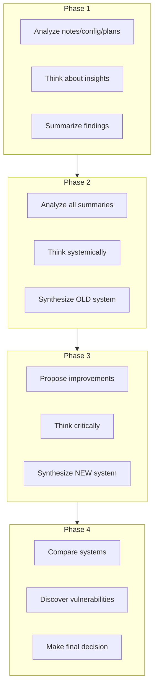

# agent-fitness ✨

A minimalist multi-agent reasoning system for fitness coaching — built **without LangChain or LangGraph** to demonstrate how agents *actually think*. Watch agents analyze workout data → debate improvements → synthesize better training plans — all with explicit, debuggable code.

> 🔑 **Core insight**: Frameworks hide *why* agents work. This repo shows *how* — through phased reasoning (Analyze → Think → Summarize → Decide) you can build meaningful agent collaboration with <200 lines of core logic.

*(Visual: Simple pipeline diagram showing data flow between agent phases)*

## Why This Exists

Most "multi-agent" tutorials are just LangChain wrappers that obscure the reasoning process. This project proves you can build **meaningful agent collaboration** with:

✅ **Explicit role separation** — Analyzer, Thinker, Summarizer agents with distinct purposes  
✅ **Phased reasoning** — From per-file insights → system synthesis → critical validation  
✅ **Decision synthesis** — Agents don't just agree/disagree — they *create better hybrid systems*  
✅ **Zero framework bloat** — Pure Python + standard libraries (PyYAML, json)  

Perfect for engineers who want to **understand agent fundamentals** before adopting complex frameworks.

## How It Works: The 4-Phase Pipeline

    
## Real Output: Agents in Action

Watch how agents transformed fragmented training data into an actionable plan:

### Input Data (Phase 1 Sources)
- `notes.md`: *"Struggling with handstand consistency — some days great, others wobbly"*
- `workout_plans.json`: `{"focus": "freestanding handstand", "current_phase": "balance/endurance"}`
- `summaries.json`: *"Week 5-8: progressing ahead of schedule on handstand control"*

### Agent Synthesis (Phase 4 Decision Output)
> **Good! Here's a concise, actionable summary of how to translate the New Exercise System into real progress:**
> 
> ### Key Takeaways
> 1. **Structure + Flexibility**: Clear phases (foundation → strength) with room to adjust based on daily energy.
> 2. **Variety to Stay Motivated**: Mix wall handstands + freestanding attempts to prevent plateaus.
> 3. **Track Everything**: Log *balance time* and *wobble frequency* — not just "did/didn't hold".
> 4. **Well-being Matters**: Handstand skill degrades with poor sleep — prioritize 7h+ nightly.
> 5. **Personalization**: Adjust volume based on wrist fatigue (common pain point for Sam).
> 
> ### Quick Action Plan
> - **Week 1–2**: 5-min daily wall drills + 3x freestanding attempts (focus on form)
> - **Week 3–4**: Introduce "max hold" challenges + wrist mobility pre-workout
> - **Ongoing**: Journal wrist comfort level (1-5 scale) after each session

👉 **This wasn't copy-pasted** — agents *synthesized* a hybrid system preserving OLD's recovery focus while adding NEW's phased structure and wrist-specific personalization.
